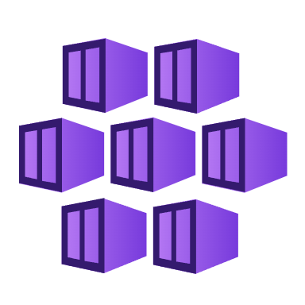
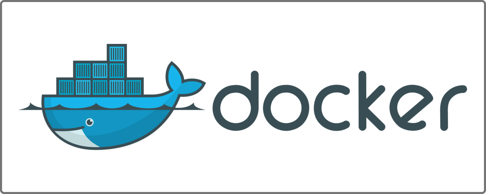
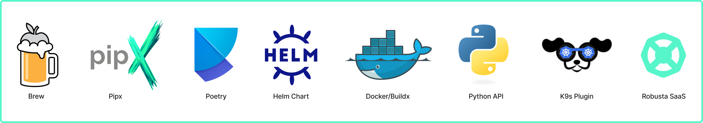

# TracePilot | 智能运维故障诊断 Agent

面向微服务线上排障：LLM 分析现象、形成假设和候选检查动作，Jev Decision Model 选择下一步，Runtime 校验范围、Schema、权限与预算，MCP 获取观测数据，Evidence Memory 保存诊断过程及证据。报告提供带来源的候选原因、验证步骤与信息缺口。

**当前分支维护者：** [mochengqian](https://github.com/mochengqian)。TracePilot 的实现与验证范围见[功能对照](docs/reference/tracepilot-implementation.md)，继承代码的来源见[来源说明](THIRD_PARTY_NOTICES.md)。

## 快速运行

Python 3.11 或 3.12，在仓库根目录执行：

```bash
python3 -m venv .venv
source .venv/bin/activate
pip install -r requirements-tracepilot.txt
python -m tracepilot demo
python -m tracepilot demo --scenario slow-dependency
python -m tracepilot demo --scenario no-data
python -m tracepilot demo --scenario denied
```

模拟模式无需密钥，使用固定观测数据和规则型测试替身，不代表真实模型效果。每次输出任务 ID；重开数据库可检查记忆、决策和原始观测：

```bash
python -m tracepilot inspect TASK_ID
python -m tracepilot evidence TASK_ID EVIDENCE_ID --offset 0 --limit 4000
python -m tracepilot verify TASK_ID
```

真实模型、PostgreSQL、MCP 和数据源配置见 [运行指南](docs/reference/tracepilot.md)。完整 Poetry 环境还提供 `tracepilot` 命令；独立入口无需加载原有集成框架。

## 核心能力

| 能力 | 实现 | 验证方式 |
| --- | --- | --- |
| 推理与动作选择分离 | `tracepilot/providers.py`、`engine.py`、`policy.py` | Jev 只能选择 Runtime 提供的动作，不能直接执行工具 |
| 多轮证据驱动排查 | `DecisionState`、结构化记忆、候选方向 | 相同超时问题根据证据进入连接池或下游分支 |
| Evidence Memory | `tracepilot/store.py`、`models.py` | 事务保存任务/观测/事件，分页读取，校验内容与来源摘要 |
| 独立 MCP 工具层 | `tracepilot/mcp_gateway.py` | stdio、Streamable HTTP、分页发现、命名空间、Schema 变化检测 |
| 真实观测接口 | `tracepilot/observability_server.py` | Loki 日志、Prometheus 指标、Tempo 调用链搜索、Kubernetes 当前实例状态 |
| 执行约束 | 本地白名单、服务/命名空间/时间范围、输入输出 Schema | 越界不调用、审批时停止、有界重试和上下文容量限制 |

连接池模拟先检查实例和调用链，再从结果定位 `checkout-a`，查询该实例日志、指标，最后检查配置变化；下游延迟模拟不会进入连接池配置分支。

## 原项目演示与使用说明

以下保留 HolmesGPT 的架构图、演示与使用入口，展示仓库中继承的工具集和排障能力。图片来自原项目；TracePilot 的双模型决策、证据存储和 MCP 运行方式见上方说明及[运行指南](docs/reference/tracepilot.md)。

### 架构与排障演示

HolmesGPT 通过 Agent 循环查询观测数据、分析问题并形成排障结论。下图为原项目架构，TracePilot 在独立运行时中增加了动作选择与执行校验。


### 数据源与集成

原有 HolmesGPT 工具集覆盖 Kubernetes、Prometheus、Grafana、云平台、数据库和告警系统。它们使用原有框架的依赖和配置；TracePilot 独立入口通过 MCP 接入工具，当前提供 Loki、Prometheus、Tempo 和 Kubernetes 的观测接口。两种入口的配置方式请分别参考对应文档。

<details>
<summary>展开原项目数据源列表</summary>

| Data Source | Notes |
|-------------|-------|
| [ **AKS**](https://holmesgpt.dev/data-sources/builtin-toolsets/aks/) | Azure Kubernetes Service cluster and node health diagnostics |
| [ **Atlassian Rovo**](https://holmesgpt.dev/data-sources/builtin-toolsets/atlassian-rovo-mcp/) | Jira issues and Confluence pages via Atlassian's hosted server (MCP) |
| [ **ArgoCD**](https://holmesgpt.dev/data-sources/builtin-toolsets/argocd/) | Get status, history and manifests and more of apps, projects and clusters |
| [ **AWS**](https://holmesgpt.dev/data-sources/builtin-toolsets/aws/) | RDS events, instances, slow query logs, and more (MCP) |
| [ **Azure**](https://holmesgpt.dev/data-sources/builtin-toolsets/azure-mcp/) | Azure resources and diagnostics (MCP) |
| [ **Confluence**](https://holmesgpt.dev/data-sources/builtin-toolsets/confluence/) | Private runbooks and documentation |
| [ **Confluence (MCP)**](https://holmesgpt.dev/data-sources/builtin-toolsets/confluence-mcp/) | Private runbooks and documentation (MCP) |
| [ **Coralogix**](https://holmesgpt.dev/data-sources/builtin-toolsets/coralogix-logs/) | Retrieve logs for any resource |
| [ **Crossplane**](https://holmesgpt.dev/data-sources/builtin-toolsets/crossplane/) | Troubleshoot Crossplane providers, compositions, claims, and managed resources |
| [ **Datadog**](https://holmesgpt.dev/data-sources/builtin-toolsets/datadog/) | Query logs, metrics, and traces |
| [ **Docker**](https://holmesgpt.dev/data-sources/builtin-toolsets/docker/) | Get images, logs, events, history and more |
| [ **Elasticsearch / OpenSearch**](https://holmesgpt.dev/data-sources/builtin-toolsets/elasticsearch/) | Query logs, cluster health, shard and index diagnostics |
| [ **GCP**](https://holmesgpt.dev/data-sources/builtin-toolsets/gcp/) | Google Cloud Platform resources (MCP) |
| [ **GitHub**](https://holmesgpt.dev/data-sources/builtin-toolsets/github-mcp/) | Repositories, issues, and pull requests (MCP) |
| [ **GitLab**](https://holmesgpt.dev/data-sources/builtin-toolsets/gitlab-mcp/) | Projects, merge requests, issues, and CI/CD pipelines (MCP) |
| [ **Jenkins (MCP)**](https://holmesgpt.dev/data-sources/builtin-toolsets/jenkins-mcp/) | Build status, pipeline logs, and job history (MCP) |
| [ **Grafana**](https://holmesgpt.dev/data-sources/builtin-toolsets/grafanadashboards/) | Query and analyze dashboard configurations and panels |
| [ **Helm**](https://holmesgpt.dev/data-sources/builtin-toolsets/helm/) | Release status, chart metadata, and values |
| [ **Internet**](https://holmesgpt.dev/data-sources/builtin-toolsets/internet/) | Public runbooks, community docs, etc. |
| [ **Kafka**](https://holmesgpt.dev/data-sources/builtin-toolsets/kafka/) | Fetch metadata, list consumers and topics or find lagging consumer groups |
| [ **Kubernetes**](https://holmesgpt.dev/data-sources/builtin-toolsets/kubernetes/) | Pod logs, K8s events, and resource status (kubectl describe) |
| [ **Kubernetes Remediation (MCP)**](https://holmesgpt.dev/data-sources/builtin-toolsets/kubernetes-remediation-mcp/) | Apply fixes like scaling, rollbacks, and resource edits (MCP) |
| [ **Loki**](https://holmesgpt.dev/data-sources/builtin-toolsets/grafanaloki/) | Query logs for Kubernetes resources or any query |
| [ **MariaDB**](https://holmesgpt.dev/data-sources/builtin-toolsets/database-mariadb/) | MariaDB database queries and diagnostics |
| [ **MongoDB**](https://holmesgpt.dev/data-sources/builtin-toolsets/mongodb/) | Query data, diagnose performance, inspect schemas, find slow operations |
| [ **MongoDB Atlas**](https://holmesgpt.dev/data-sources/builtin-toolsets/mongodb-atlas/) | Cluster health, slow queries, and performance diagnostics |
| [ **NewRelic**](https://holmesgpt.dev/data-sources/builtin-toolsets/newrelic/) | Investigate alerts, query tracing data |
| [ **OpenShift**](https://holmesgpt.dev/data-sources/builtin-toolsets/openshift/) | Projects, routes, builds, security context constraints, and deployment configs |
| [ **Prefect (MCP)**](https://holmesgpt.dev/data-sources/builtin-toolsets/prefect-mcp/) | Workflow orchestration monitoring, flow runs, and worker health (MCP) |
| [ **Prometheus**](https://holmesgpt.dev/data-sources/builtin-toolsets/prometheus/) | Investigate alerts, query metrics and generate PromQL queries |
| [ **RabbitMQ**](https://holmesgpt.dev/data-sources/builtin-toolsets/rabbitmq/) | Partitions, memory/disk alerts, troubleshoot split-brain scenarios and more |
| [ **Robusta**](https://holmesgpt.dev/data-sources/builtin-toolsets/robusta/) | Multi-cluster monitoring, historical change data, runbooks, PromQL graphs and more |
| [ **ServiceNow**](https://holmesgpt.dev/data-sources/builtin-toolsets/servicenow/) | Query tables and incident records |
| [ **Sentry**](https://holmesgpt.dev/data-sources/builtin-toolsets/sentry-mcp/) | Error tracking, issues, and performance monitoring (MCP) |
| [ **Slab**](https://holmesgpt.dev/data-sources/builtin-toolsets/slab/) | Team knowledge base and runbooks on demand |
| **Splunk** | Log search and analysis (MCP) |
| [ **SQL Databases**](https://holmesgpt.dev/data-sources/builtin-toolsets/database-postgresql/) | PostgreSQL, MySQL, ClickHouse, MariaDB, SQL Server, Azure SQL, SQLite |
| [ **Tempo**](https://holmesgpt.dev/data-sources/builtin-toolsets/grafanatempo/) | Fetch trace info, debug issues like high latency in application |
| [ **VictoriaLogs**](https://holmesgpt.dev/data-sources/builtin-toolsets/victorialogs/) | Query logs from VictoriaLogs using LogsQL |
| **VictoriaMetrics** | Query metrics from a Prometheus-compatible TSDB (`vmsingle` / `vmcluster`) |
| [ **Zabbix**](https://holmesgpt.dev/data-sources/builtin-toolsets/zabbix/) | Monitor hosts, problems, events, triggers, and historical metrics |


</details>

更多说明见[内置工具集](https://holmesgpt.dev/data-sources/builtin-toolsets/)与[自定义工具集](https://holmesgpt.dev/data-sources/custom-toolsets/)。

### 安装与模型配置

下列图片和链接对应原有 HolmesGPT 的安装方式及模型集成。运行 TracePilot 请使用本页“快速运行”和 [TracePilot 配置说明](docs/reference/tracepilot.md)。

[](https://holmesgpt.dev/installation/cli-installation/)

[](https://holmesgpt.dev/ai-providers/)

### 使用入口

- [交互式排障与追问](https://holmesgpt.dev/latest/walkthrough/interactive-mode/)
- [调查 Prometheus 告警](https://holmesgpt.dev/latest/walkthrough/investigating-prometheus-alerts/)
- [CI/CD 故障排查](https://holmesgpt.dev/latest/walkthrough/cicd-troubleshooting/)
- [原项目完整说明](UPSTREAM_README.md)

## 测试

```bash
pip install pytest responses
python -m pytest -c tests/tracepilot/pytest.ini --confcutdir=tests/tracepilot \
  tests/tracepilot tests/decision/test_engine.py tests/decision/test_runtime_regressions.py \
  tests/decision/test_store.py tests/decision/test_providers.py
```

[CI](.github/workflows/tracepilot-tests.yml) 配置了独立 PostgreSQL 测试数据库；本地未设置 `HOLMES_TEST_POSTGRES_URL` 时会明确跳过对应测试。
[简历能力与实现对照](docs/reference/tracepilot-implementation.md) 记录新增内容和验证边界。

## 来源与边界

本仓库由 HolmesGPT 派生；TracePilot 是本分支的产品名称。原有代码与贡献记录保留，新增工作与既有实现的关系见 [来源说明](THIRD_PARTY_NOTICES.md)。[原始 README](UPSTREAM_README.md) 和 [Apache-2.0 许可证](LICENSE) 保留。

`completed` 表示调查流程结束，不表示根因已确认。引用校验能检查来源，不能证明推断在语义上正确。生产准确率、成本收益与 Jev 概率校准需要接入目标环境后测量。当前为单用户 CLI，未实现多租户调度、自动修复或中断任务自动重放。
